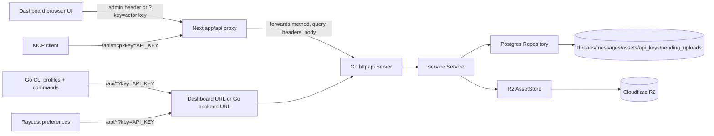
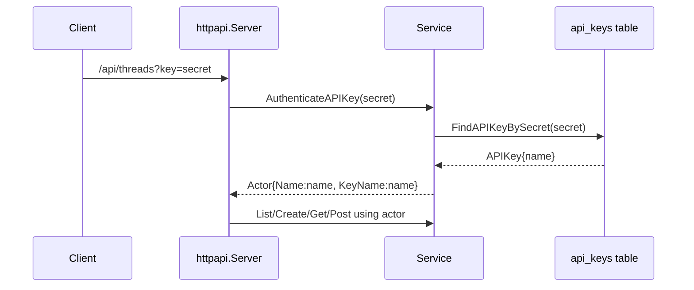
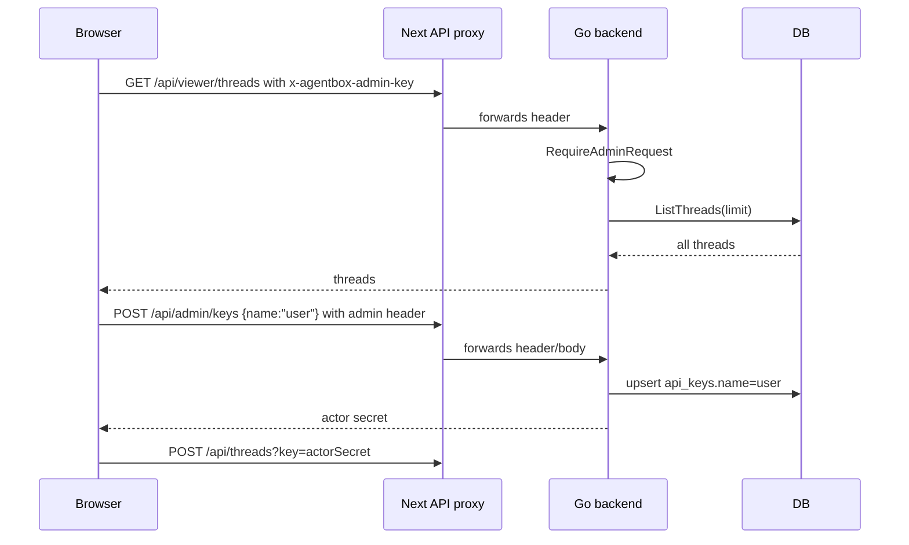
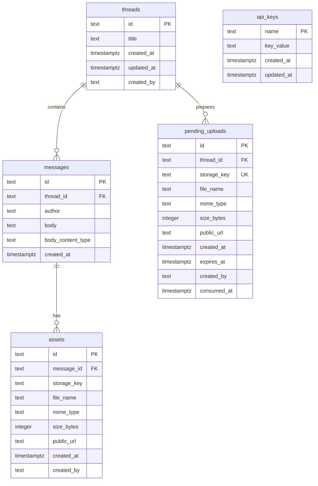
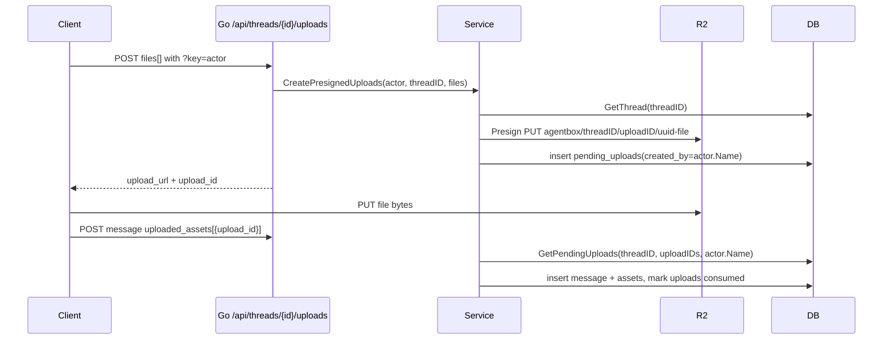

# Agentbox Multitenancy/Auth Research Report

Date: 2026-07-07

Scope note: This report is source-code research only. I did not implement changes. "Current-state fact" means directly observed in source, tests, migrations, or config. "Implementation inference" means a likely future touchpoint or risk derived from the current architecture.

## Executive Summary

Current-state fact: Agentbox is effectively a single shared workspace. The Go backend authenticates normal API and MCP traffic with a DB-backed API key passed as the `key` query parameter. The API key maps to an actor name only, not to a user, tenant, organization, or permission set. Admin operations use one deployment-level admin secret from `AGENTBOX_ADMIN_KEY`, accepted via `x-agentbox-admin-key` or `Authorization: Bearer`.

Current-state fact: Thread, message, asset, pending-upload, and API-key tables have no tenant/user columns. Access checks authenticate that a key exists, then all authenticated actors can list/search/read/post all threads and request signed URLs for any asset by asset id. The only ownership-style check found is pending upload finalization, which requires the same actor name that created the upload intent.

Implementation inference: Multitenancy will need to be introduced at the auth boundary, database schema, repository queries, service methods, storage key construction, dashboard storage model, CLI profile model, Raycast preferences, and MCP URL generation. The safest migration path is probably to preserve the current "actor name appears on threads/messages/assets" pattern while adding separate tenant/user identity and authorization context behind it.

## Architecture Map

Current-state fact: The system is split across:

- Go backend service: `cmd/api/main.go`, `internal/agentbox/httpapi`, `internal/agentbox/service`, `internal/agentbox/db`, `internal/agentbox/assets`, `internal/agentbox/mcpserver`, `internal/agentbox/auth`, `internal/agentbox/config`.
- Next.js dashboard: `app/*` pages and `app/api/*` proxy routes. Most API routes forward to the Go backend.
- Go CLI: `cmd/agentbox/main.go`, `internal/agentbox/cli`, `internal/agentbox/profiles`.
- Raycast extension: `raycast/agentbox/src/*`, `raycast/agentbox/package.json`.
- Postgres schema/migrations: `migrations/*.sql` plus duplicated schema bootstrap in `internal/agentbox/db/repository.go`.
- R2 storage: implemented in `internal/agentbox/assets/assets.go`.

## Auth And API Key Validation

Current-state fact: Normal API routes call `requireActor` in `internal/agentbox/httpapi/server.go`. It reads only `r.URL.Query().Get("key")`, calls `service.AuthenticateAPIKey`, and returns `401 Unauthorized` if no matching DB key exists. There is no bearer/header normal API-key path.

Current-state fact: `service.AuthenticateAPIKey` trims the secret, calls `Repository.FindAPIKeyBySecret`, and returns `types.Actor{Name: key.Name, KeyName: key.Name}`. Actor identity is therefore only the API-key name.

Current-state fact: API keys are stored in plaintext in `api_keys.key_value`. Lookup is a direct equality query on `key_value`.

Current-state fact: Admin auth is separate from DB API keys. `internal/agentbox/auth/auth.go` validates `AGENTBOX_ADMIN_KEY` against either `x-agentbox-admin-key` or `Authorization: Bearer <key>` using constant-time comparison after length match.

Current-state fact: MCP authentication is in `mcpHandler`; it also reads only the `key` query parameter after optional origin validation via `AGENTBOX_ALLOWED_ORIGINS`.

Implementation inference: Future auth should probably introduce an auth context object separate from `types.Actor`. The actor name is useful audit/display data, but tenant isolation needs distinct fields such as `tenant_id`, `user_id`, `subject_type`, `scopes`, and possibly `actor_display_name`.

## Admin Key And Key Management Flows

Current-state fact: Admin endpoints:

- `GET /api/admin/keys`: requires admin key, returns all API key names and masked secrets.
- `POST /api/admin/keys`: requires admin key, accepts `{ "name": string }`, creates or replaces that named key, returns the secret once.
- `DELETE /api/admin/keys/{name}`: requires admin key, deletes by name.

Current-state fact: `service.CreateAPIKey` generates 32 random bytes and hex-encodes them. `Repository.CreateAPIKey` uses `insert ... on conflict (name) do update set key_value = excluded.key_value, updated_at = now()`, so reusing a name rotates/replaces the key.

Current-state fact: `ListAPIKeys` returns masked values only. `scanAPIKey` computes `key_masked`; `types.APIKey.Key` is JSON-hidden except the admin create response manually includes it.

Current-state fact: Tests in `internal/agentbox/httpapi/server_test.go` assert unauthorized admin requests fail, create returns a secret, list does not leak the raw secret, and revoke immediately causes the key to fail normal API auth.

Implementation inference: Tenant-aware key management will need either tenant-scoped admin credentials or user auth plus authorization checks. The current primary key `api_keys.name` blocks same key name reuse across tenants, so a migration likely needs `tenant_id + name` uniqueness and a non-plaintext secret hash/token id model.

## Dashboard And API Proxy Auth Assumptions

Current-state fact: Next.js API route handlers in `app/api/*` mostly call `proxyToGoBackend`. The proxy uses `AGENTBOX_BACKEND_URL` or `AGENTBOX_GO_BACKEND_URL`, preserves incoming query string, forwards headers except `host` and `content-length`, and streams non-GET bodies to the backend.

Current-state fact: `next.config.ts` also defines `/api/:path*` rewrites to the backend when the backend URL is configured. There is therefore both explicit route proxying and framework-level rewrite behavior.

Current-state fact: The browser dashboard currently stores the admin key in localStorage under `agentbox_admin_key` in `app/keys/keys-view.tsx`, `app/threads/inbox-view.tsx`, and `app/threads/[threadId]/thread-view.tsx`.

Current-state fact: `/keys` uses the admin key to create/list/delete DB API keys. New key creation builds an MCP URL from `window.location.origin + "/api/mcp?key=secret"`.

Current-state fact: `/threads` and `/threads/[threadId]` use admin viewer routes for read access: `/api/viewer/threads` and `/api/viewer/threads/{id}` with `x-agentbox-admin-key`.

Current-state fact: Dashboard posting is not performed as the admin. `app/components/agentbox-write.ts` uses the admin key to create or rotate a hidden DB API key named `user`, saves that actor key in localStorage under `agentbox_actor_key`, then posts through normal actor endpoints using `?key=<actorKey>`.

Current-state fact: `app/components/viewer-profiles.ts` has a newer localStorage model for multiple viewer profiles (`agentbox_viewer_profiles_v1`) and migrates from `agentbox_admin_key`, but the currently read dashboard pages still use `agentbox_admin_key` directly.

Implementation inference: Browser login will likely replace localStorage admin-key entry with a server/session-backed user identity. The dashboard's hidden global `user` actor key is a high-risk multitenancy collision because it is one global `api_keys.name` today and will rotate for every dashboard/admin that uses it.

## CLI Touchpoints

Current-state fact: CLI profiles live in `internal/agentbox/profiles`. Stored profiles contain `name`, `base_url`, and `api_key`. Resolution order is:

- `AGENTBOX_PROFILES` JSON
- stored config selected by `--profile`, `AGENTBOX_PROFILE`, active profile, or first profile
- legacy `AGENTBOX_BASE_URL` or `AGENTBOX_URL` plus `AGENTBOX_API_KEY`

Current-state fact: `internal/agentbox/cli/cli.go` builds every normal endpoint by resolving the profile base URL and appending `key=<profile API key>` to the query string.

Current-state fact: CLI `doctor` checks profile resolution, unauthenticated `/api/health`, authenticated `/api/threads?limit=10`, optional signed download URL for a recent attachment, and MCP URL construction.

Current-state fact: `mcp-url` prints `/api/mcp?key=<profile API key>`. `connect chatgpt` prints the same URL and "no auth" setup steps for ChatGPT.

Current-state fact: `init` uses an admin key to create two remote DB API keys: a local key saved into the CLI profile and a ChatGPT key printed with an MCP URL. `keys create/list/revoke` use the admin API and `x-agentbox-admin-key`.

Current-state fact: CLI thread/message commands consume the same public API as Raycast/MCP: list/search/create/get/download/post. File download first asks the backend for a signed asset download URL, then performs a direct GET to R2.

Implementation inference: Browser CLI login will need a replacement or supplement for profile `api_key`. Possible touchpoints include `profiles.Profile`, profile JSON schema, `runtimeConfig`, `endpoint`, `request`, `doctor`, `mcp-url`, `connect`, and `init`. Remote MCP URL generation is currently local string construction; a future login flow may need a server-issued connector URL or OAuth-style token exchange rather than embedding a long-lived API key in a URL.

## MCP Endpoint And URL Construction

Current-state fact: `/api/mcp` accepts GET, POST, and DELETE. It validates allowed origins if configured, authenticates the `key` query parameter, and then creates a stateless streamable MCP handler with the resolved actor.

Current-state fact: `internal/agentbox/mcpserver/mcpserver.go` exposes tools: `list_threads`, `search_threads`, `get_thread`, `create_thread`, and `post_message`. All tools call service methods with the actor captured at handler construction.

Current-state fact: MCP `post_message` supports a ChatGPT file attachment input. It expects either a structured `{download_url, file_id, mime_type?, file_name?}` object or a URL-ish raw string. Local file paths or plain filenames are rejected by `NormalizeChatGPTFileInput`.

Current-state fact: MCP server options are stateless, JSON response, no session timeout, and localhost protection disabled. There is no per-session state or tenant context beyond the actor key authenticated at HTTP entry.

Implementation inference: A tenant-aware MCP endpoint must ensure every tool call carries the authenticated tenant context into service/repository calls. The current remote MCP URL shape leaks a credential through URL query strings, browser history, logs, and copied setup text. Moving to hosted/browser login or remote connectors likely requires a URL that identifies the service plus a server-side auth handshake, not just `?key=`.

## Thread, Message, Ownership, And Access Patterns

Current-state fact: Database ownership-like fields are display/audit fields:

- `threads.created_by`
- `messages.author`
- `assets.created_by`
- `pending_uploads.created_by`
- `api_keys.name`

Current-state fact: There is no `tenant_id`, `user_id`, `owner_id`, `workspace_id`, `org_id`, ACL table, membership table, or scope table in current schema or types.

Current-state fact: Thread listing and searching are global. `ListThreads` orders all `threads` by `updated_at desc`. `SearchThreads` searches all thread titles/messages and optionally filters by `created_by` and `updated_after`. `created_by` is a user-provided API-key name, not a secure ownership boundary.

Current-state fact: `GetThread` fetches one thread by id, all messages by thread id, then all assets by message ids. There is no actor/tenant argument.

Current-state fact: `PostMessage` first calls `GetThread` to verify the thread exists, then inserts a message with `author=actor.Name` and updates thread `updated_at`.

Current-state fact: There are no update/delete endpoints for threads or messages in current HTTP routes. Delete exists only for API keys.

Implementation inference: Tenant isolation must be added to every repository method signature or to a request-scoped repository/session context. Relying on `created_by` would be incorrect because keys are mutable, names collide, dashboard currently uses global `user`, and `created_by` only indicates actor label.

## Attachment Upload, Finalize, Download, And R2 Storage

Current-state fact: There are three attachment paths:

- JSON/MCP ChatGPT file reference: backend downloads from `download_url`, uploads bytes to R2, then inserts an asset on the posted message.
- Multipart message post: backend receives `asset`, uploads bytes to R2, then inserts an asset.
- Direct browser/Raycast upload: client asks `/api/threads/{id}/uploads?key=...` for presigned PUT URLs, uploads directly to R2, then posts a message with `uploaded_assets: [{upload_id}]` to finalize.

Current-state fact: R2 storage keys are built by `assets.MakeStorageKey(threadID, messageHint, fileName)` as:

`agentbox/{threadID}/{messageHint}/{uuid}-{sanitizedFileName}`

Current-state fact: Direct upload intent uses `messageHint=uploadID`. Multipart upload uses `messageHint=message` unless supplied. ChatGPT file upload uses `messageHint=fileID`.

Current-state fact: `pending_uploads.storage_key` is globally unique. `pending_uploads.thread_id` references `threads(id)`. Finalization queries pending uploads by `thread_id`, `created_by`, and upload ids. This is the one current actor-bound access pattern.

Current-state fact: Asset download URL endpoint authenticates an actor key, then fetches any asset by asset id and returns a signed R2 GET URL. It does not verify that the asset belongs to a thread visible to the caller because there is only one visibility scope today.

Current-state fact: Admin viewer thread response pre-generates signed download URLs for all assets in the thread, using 300 seconds normally and 900 seconds for image previews.

Implementation inference: Tenant isolation should probably include tenant-qualified R2 prefixes, for example `agentbox/{tenantID}/{threadID}/...`, or a migration strategy for existing keys. Signed download must verify tenant ownership before signing, not just authenticate any actor. Pending upload finalization needs tenant checks and probably a stronger upload-intent owner id than actor name.

## Database, Migrations, DAL, And Service Boundaries

Current-state fact: Schema exists both in migration files and in `Repository.EnsureSchema`. `EnsureSchema` is called at the start of most repository methods, so schema creation is lazy/defensive at runtime in addition to migrations.

Current-state fact: `cmd/api/main.go` can run `EnsureSchema` on startup only when `AGENTBOX_AUTO_MIGRATE` is true. Separate migration command exists at `cmd/migrate/main.go`.

Current-state fact: Service layer owns validation, content-type resolution, API-key generation, actor-to-author mapping, pending upload conversion, and R2 calls. Repository layer owns SQL and persistence. HTTP layer owns request parsing/auth entry and status-code mapping.

Current-state fact: Repository method signatures mostly do not accept actor, admin, or auth context. Methods operate globally except `GetPendingUploads(threadID, uploadIDs, author)`.

Implementation inference: Tenant work is likely broad because tenancy should enter at service/repository boundaries. Adding ad hoc filters only at HTTP handlers would leave MCP and future internal callers risky. Adding `AuthContext`/`TenantContext` to service methods, then repository methods, would preserve the existing layer separation.

## Deployment, Env, And Config Touchpoints

Current-state fact: Backend config envs in `internal/agentbox/config/config.go`:

- `DATABASE_URL`
- `AGENTBOX_DB_POOL_SIZE`
- `AGENTBOX_ALLOWED_ORIGINS`
- `AGENTBOX_ADMIN_KEY`
- `R2_ACCOUNT_ID`
- `R2_ACCESS_KEY_ID`
- `R2_SECRET_ACCESS_KEY`
- `R2_BUCKET`
- `R2_PUBLIC_BASE_URL`
- `AGENTBOX_MAX_FILE_SIZE_BYTES`
- `AGENTBOX_ENV`
- `NODE_ENV`
- `VERCEL_ENV`
- `AGENTBOX_AUTO_MIGRATE`

Current-state fact: Dashboard proxy config uses `AGENTBOX_BACKEND_URL` or `AGENTBOX_GO_BACKEND_URL`. Vercel config files only set framework and region.

Current-state fact: CLI deploy helper prints commands to add backend env, run migrations, run `agentbox init`, and configure dashboard `AGENTBOX_BACKEND_URL`.

Implementation inference: Multitenancy/auth migration may introduce env/config for auth issuer, OAuth client IDs/secrets, cookie/session signing, public app URL, tenant defaulting, key hashing/pepper, and migration flags. Split backend/dashboard deployment means any browser login callback/session cookie assumptions must account for the dashboard domain proxying backend routes.

## Raycast Touchpoints

Current-state fact: Raycast preferences are `baseUrl`, `apiKey`, and optional `downloadDirectory`. `baseUrl` may be dashboard/proxy URL or direct API URL. Every authenticated request appends `key=<apiKey>`.

Current-state fact: Raycast constructs MCP URLs with the same `baseUrl + /api/mcp?key=apiKey`. Dashboard thread URLs use `baseUrl + /threads/{threadId}`. Doctor checks only validate local preference shape, health, authenticated `/api/threads?limit=1`, and MCP URL construction.

Current-state fact: Raycast attachment upload uses direct presigned URLs and finalizes through normal post-message API. Download actions call backend signed-download endpoint then fetch the R2 URL directly.

Implementation inference: If future auth is login/session-based, Raycast likely still needs a headless credential model. It can continue to consume API keys if those become tenant-scoped personal tokens, but profile/preferences will need tenant/account clarity and MCP URL generation may need a server-issued URL rather than local query-string composition.

## Likely Affected Files And Reasons

- `migrations/*.sql`: add tenants/users/memberships/key ownership columns and indexes; backfill existing singleton data.
- `internal/agentbox/types/types.go`: add tenant/user/auth context types and fields on persisted DTOs if exposed.
- `internal/agentbox/auth/auth.go`: replace or supplement deployment admin-key auth; add session/bearer/token verification.
- `internal/agentbox/config/config.go`: new auth/session/OAuth/public URL config.
- `internal/agentbox/httpapi/server.go`: all route auth boundaries, actor/admin resolution, tenant-aware calls, viewer semantics, MCP auth.
- `internal/agentbox/service/service.go`: carry auth context into list/search/get/create/post/upload/download/key management operations.
- `internal/agentbox/db/repository.go`: tenant-scoped schema, queries, uniqueness, migrations mirrored in `EnsureSchema`, asset ownership checks.
- `internal/agentbox/db/memory.go`: test parity for tenant-scoped behavior.
- `internal/agentbox/assets/assets.go`: tenant-aware R2 key prefixes; signed URL authorization inputs.
- `internal/agentbox/mcpserver/mcpserver.go`: tenant context propagation into all tools and possibly remote MCP auth changes.
- `internal/agentbox/cli/cli.go`: profile runtime config, request auth, doctor, MCP URL, download, future login command.
- `internal/agentbox/cli/bootstrap.go`: `init`, `connect`, `keys`, and remote key creation/list/revoke flows.
- `internal/agentbox/profiles/profiles.go`: persisted profile schema and env profile shape for login/token/tenant metadata.
- `app/api/_proxy/proxy.ts` and `app/api/*`: proxy header/cookie behavior and auth callback/session route interactions.
- `app/keys/keys-view.tsx`: admin-key UI replaced by user/tenant key management; MCP URL construction.
- `app/threads/inbox-view.tsx`, `app/threads/[threadId]/thread-view.tsx`, `app/components/agentbox-write.ts`: viewer auth, localStorage admin/actor key model, hidden `user` key creation.
- `app/components/viewer-profiles.ts`: possible migration or removal of browser-stored admin profile model.
- `raycast/agentbox/src/api.ts`: preference model, auth transport, MCP/dashboard URL construction.
- `raycast/agentbox/src/doctor.tsx`: new auth diagnostics and tenant/account display.
- `raycast/agentbox/package.json`: preference definitions.
- Tests under `internal/agentbox/*/*_test.go`: auth, key, tenant isolation, uploads, MCP, CLI profiles, Raycast-like URL assumptions.

## Existing Patterns To Preserve

- Keep API-key names as actor labels for `created_by`, `author`, and human-readable audit trails, but do not treat them as tenant/user identity.
- Preserve service/repository separation: HTTP parses/authenticates, service validates/orchestrates, repository owns persistence.
- Preserve typed coded errors (`CodedError`) and consistent `code`/`error` JSON payloads for CLI/Raycast/MCP consumers.
- Preserve "secret shown once" semantics for API key creation and masked values in list output.
- Preserve explicit direct upload intent/finalize model and the current actor-bound pending upload finalization constraint, but strengthen it with tenant/user ids.
- Preserve CLI profile compatibility where possible by migrating old `base_url + api_key` profiles into a new tenant-aware shape.
- Preserve dashboard proxy behavior for dashboard-hosted API URLs, but be deliberate about cookies/session headers and backend origin.
- Preserve stable MCP tool names and response shapes unless a migration plan coordinates ChatGPT/Raycast/CLI docs and users.

## Risks And Unknowns

Tenant isolation risks:

- Current global queries would leak all data if tenant filtering is incomplete.
- Asset download by asset id currently signs any asset after any valid actor key; this must become tenant-checked.
- R2 keys lack tenant prefix, which complicates future bulk policies and debugging.
- `api_keys.name` primary key prevents same name in different tenants and makes dashboard `user` key globally dangerous.
- `created_by`/`author` values are mutable API-key labels, not stable user ids.

Auth migration risks:

- Plaintext `api_keys.key_value` may need hashing/token-prefix lookup migration.
- Current clients put secrets in query strings. Moving auth to headers/cookies/OAuth will require compatibility strategy for CLI, Raycast, MCP, browser, and existing copied MCP URLs.
- Admin key is deployment-wide. Replacing it with tenant admins changes setup, dashboard key management, and CLI `init` flows.
- `AGENTBOX_ALLOWED_ORIGINS` only protects MCP origin; normal API endpoints do not use it.

Browser CLI login risks:

- CLI currently has no browser callback/listener login flow; profiles only store base URL and API key.
- `doctor`, `mcp-url`, `connect`, and all request helpers assume an API key can be appended as a query parameter.
- Login state and tenant selection need a file format compatible with existing `profiles.json`, env profiles, and one-off env vars.

Automatic user API key creation risks:

- Dashboard auto-creates/replaces a key named `user`; in a global namespace this rotates the same key for everyone.
- Browser localStorage stores both admin key and hidden actor key. In multitenancy this must not silently mix tenants or profiles.
- The newer viewer profile helper exists, but the main pages still use legacy `agentbox_admin_key` directly.

Remote MCP URL generation risks:

- Current MCP URL is locally constructed by CLI, Raycast, and dashboard as `/api/mcp?key=secret`.
- A remote/login-based MCP design may need server-generated connector URLs, tenant selection, token rotation, and revocation semantics.
- Query-string credentials can appear in logs and browser history; compatibility with existing MCP clients must be planned.

Unknowns:

- No current source-level user account, tenant, org, invitation, billing, or membership concepts were found.
- No current update/delete thread/message access patterns exist beyond API-key revocation.
- No current server-side browser sessions or CSRF protection were found because dashboard uses localStorage credentials and API proxying.
- No current per-key scopes/permissions were found; all actor keys can read and write the shared workspace.

## Current-State Fact Versus Inference Checklist

Current-state fact:

- Single shared workspace data model.
- Normal API/MCP auth by `?key=...`.
- Admin auth by deployment admin secret.
- API key maps to actor name only.
- DB tables lack tenant/user ownership fields.
- Dashboard read access uses admin viewer endpoints.
- Dashboard write access auto-creates/uses a hidden `user` API key.
- CLI/Raycast construct authenticated URLs client-side.
- R2 object keys are `agentbox/{threadID}/{messageHint}/{uuid}-{filename}`.

Implementation inference:

- Tenant isolation needs schema, service, repository, storage, dashboard, CLI, Raycast, MCP, and deployment changes.
- Actor labels should remain for attribution but must not be the authorization identity.
- Future browser login and remote MCP likely need server-issued auth/session/token flows rather than copied long-lived query-string secrets.
